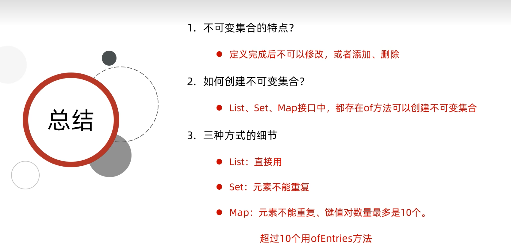
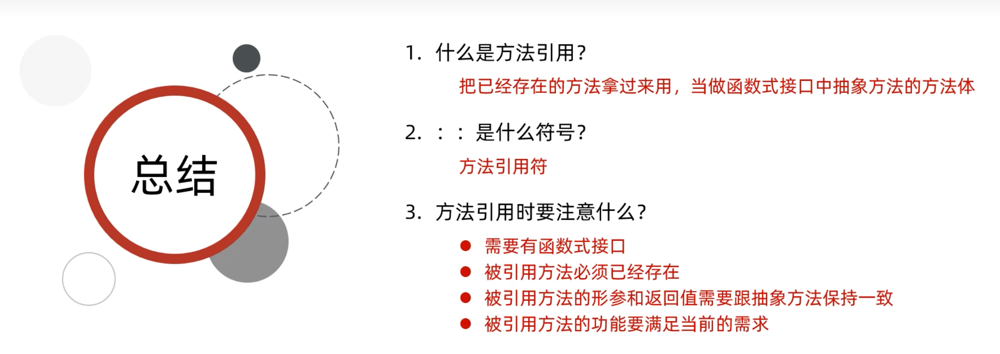
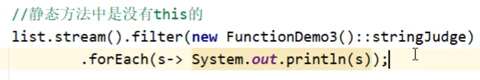
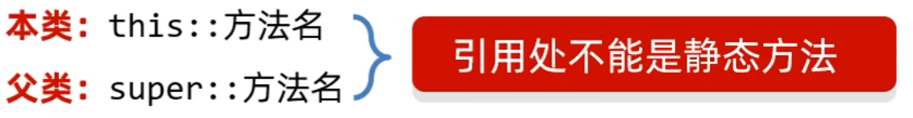
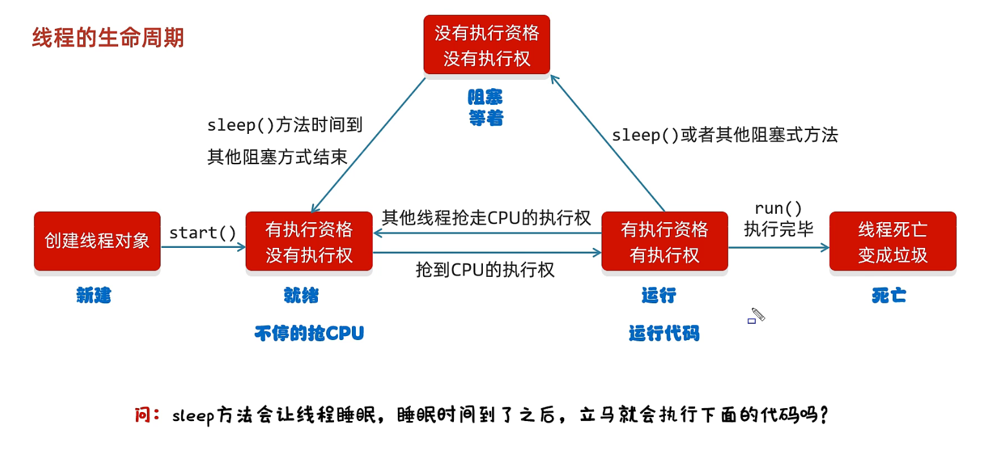
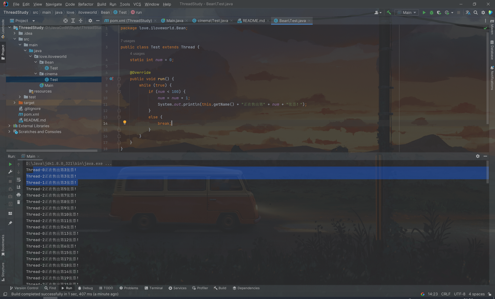

面向对象之API的使用

## 浅克隆

### clone()克隆对象

```java
 protected native Object clone() //clone是受保护的
```

Cloneable 接口

- 如果一个接口里面没有抽象方法
- 表示当前的接口是一个标记性接口
- 现在Cloneable表示一旦了实现，那么当前类的对象就可以被克隆
- 如果没有实现，当前类的对象就不能克隆


> 也就是子类和父类在不在同一个包中对于父类protected修饰的成员访问权限是不同的。
> 子类与父类在同一包中:被声明为 protected 的成员能被同一个包中的任何其他类访问；
> 子类与父类不在同一包中:那么在子类中，子类只可以访问其从父类继承而来的自己的protected成员，而不能访问父类实例以及和父类在同一个包下的其他子类实例的protected成员。
>
> 很典型的一个例子就是Object的clone（）方法，这个方法只能允许对象克隆自己的对象,而不能克隆Object对象,因为所有对象的clone方法都是继承的Object类的clone方法,但是这个方法是protected修饰的,它的可见性是Object的所有子类和java.lang包但是异包子类不能直接访问父类的受保护成员

## 深克隆

使用第三方工具实现

导入别人写的代码gson.jar包到lib，再点击Add as Library

```java
Gson gson = new Gson();
String s = gson.toJson(要深克隆的对象);//他会将数据转化为字符串
Student s =gson.fromJson(s, Student.class);//s为克隆对象转化的字符串， Student.class 为 s 要转化后的类名
```


## 总结

1. Object是Java中的顶级父类。
所有的类都直接或间接的继承于0bject类。
2. toString()： 一般会重写，打印对象时打印属性。
3. equals()： 比较对象时会重写，比较对象属性值是否相同。
4. clone( )：默认浅克隆。
如果需要深克隆需要重写方法或者使用第三方工具类。（Gson）


## Objects工具类

1. Objects是一个对象工具类，提供了一些操作对象的方法。
2. equals(对象1,对象2) ：先做非空判断，比较两个对象。
3. isNull(对象)：判断对象是否为空。
4. nonNull(对象)：判断对象是否不是空。


## BigInteger

#### 构造方法小结：

- 如果BigInteger表示的数字没有超出long的范围，可以用静态方法获取。
- 如果BigInteger表示的超出long的范围，可以用构造方法获取。
- 对象一旦创建，BigInteger内部记录的值不能发生改变。
- 只要进行计算都会产生一个新的BigInteger对象

 

#### 使用方法演例：

> 如果你要计算的数据在-16~16之间就不用new，直接调用其静态方法valueOf()；

#### 方法小结：

1. BigInteger表示一个大整数。
2. 如何获取BigInteger的对象?
  1. BigInteger b1 = BigInteger . value0f(0.1);
  2. BigInteger b1 = new BigInteger("整数" );
3. 常见操作
  1. 加: add
  2. 减: subtract
  3. 乘: multiply
  4. 除: divide、 divideAndRemainder
  5. 比较: equals、 max、min
  6. 次幂: pow
  7. 转成整数: intValue、 longValue


## BigDecima

用途：小数的精确运算


细节注意：

- 如果要表示的数字不大，没有超出double的取值范围，建议使用静态方法
- 如果要表示的数字比较大，超出了double的取值范围， 建议使用构造方法
- 如果我们传递的是0~10之间的整数，包含0和10，那么用方法返回已经创建好的对象。

> HALF_UP 四舍五入


1. BigDecimal的作用是什么?、
  - 表示较大的小数和解决小数运算精度失真问题
2. BigDecimal的对象 如何获取?
   - BigDecimal bd1 = new BigDecimal("较大的小数");
   - BigDecimal bd2 = BigDecimal. value0f(0.1);
3. 常见操作 
   - 加: add
   - 减: subtract
   - 乘: multiply
   - 除: divide (四舍五入: RoundingMode .HALF_ UP)


## 正则表达式

> 作用一：校验字符串是否满足规则
> 作用二：在一段文本中查找满足要求的内容


```
\表示转义字符
\\前面的\是一个转义字符，改变了后面\原本的含义，把他变成一个普普通通的\而己。
```

##### any-rule插件：写正则表达式的插件


小结：


- Pattern：表示正则表达式
- Matcher：文本匹配器，作用按照正则表达式的规则去读取字符串，从头开始读取。
  在大串中去找符合匹配规则的子串。


1. 正则表达式中分组有两种:
   - 捕获分组、非捕获分组
2. 捕获分组(默认):
   - 可以获取每组中的内容反复使用。
3. 组号的特点:
   - 从1开始，连续不间断
   - 以左括号为基准,最左边的是第一-组
4. 非捕获分组:
   -  分组之后不需要再用本组数据，仅仅把数据括起来，不占组号。
   - (?:) (?=) (?!)都是非捕获分组

## Date 时间

1. 如何创建日期对象?
   - Date date = new Date();
   - Date date = new Date(指定毫秒值);
2. 如何修改时间对象中的毫秒值	
   - setTime(毫秒值);
3. 如何获取时间对象中的毫秒值
   - getTime();


```java
String start = "2023年11月11日0:0:0";
String end = "2023年11月11日0:10:0";  //定义字符串形式的时间
String order = "2023年11月11日 0:0:3";

SimpleDateFormat sdf = new SimpleDateFormat("yyyy年MM月dd日HH:mm:ss");
Date startDate = sdf.parse(start);
Date endDate = sdf.parse(end);//解析字符串得到日期对象
Date orderorder = sdf.parse(order);
long startTime = startDate.getTime();
long endTime = endDate.getTime();//得到毫秒值
long orderTime = orderorder.getTime();
if(orderTime >= startTime && orderTime <= endTime){//判断
	System.out.println("参加秒杀活动成功");
}else{
	System.out.println("未在指定时间下单");

```


## SimpleDateFormat 时间


使用方法：

1. 指定一个时间显示格式，就是new 一个SimpleDateFormat对象
2. 将时间字符串解析parse成时间对象date
3. sout 时间对象

```java
String girlFriend = "2000-11-11";
SimpleDateFormat s = new SimpleDateFormat("yyyy-MM-dd");
Date parse = s.parse(girlFriend);
SimpleDateFormat ns = new SimpleDateFormat("yyyy年MM月dd日");
String format = ns.format(parse);//格式对象去转化date成想要的字符串
System.out.println(format);
```

1. SimpleDateFormat的两个作用
格式化 parse 
解析 format
2. 如何指定格式
    yyyy年MM月dd日HH: mm: SS

## Calendar

| 方法名                                       | 说明                        |
| :------------------------------------------- | :-------------------------- |
| public final Date **getTime**()              | 获取日期对象                |
| public final **setTime**(Date date)          | 给日历设置日期对象          |
| public long **getTimeInMillis**( )           | 拿到时间毫秒值              |
| public void **setTimeInMillis**(long millis) | 给日历设置时间毫秒值        |
| public int **get**(int field)                | 取日历中的某个字段信息      |
| public void **set**(int field, int value)    | 修改日历的某个字段信息      |
| public void **add**(int field, int amount)   | 为某个字段增加/减少指定的值 |

####  细节：

1. Calendar是一个接口，不能创建它的抽象方法，可以通过它的一个静态方法获得到子类对象

   Calendar.getInstance();

   底层原理:
   	会根据系统的不同时区来获取不同的日历对象,默认表示当前时间。
   	把会把时间中的纪元，年，月，日，时，分，秒，星期，等等的都放到一个数组当中

2. **月份:范围0~11 如果获取出来的是e.那么实际上是1月。**

3. 星期:在老外的眼里，星期日是一周中的第一天

   1 (星期日)

   2 (星期一) 

   3 (星期二)

   4 (星期三)

   5 (星期四)

   6 (星期五)

   7 (星期六)


## JDK8新增时间类


## Instant时间戳

| 方法名                                      | 说明                              |
| ------------------------------------------- | --------------------------------- |
| static Instant **now**()                    | 获取当前时间的nstant对象(标准时间 |
| static Instant **ofXxxx**(long epochMilli)  | 根据(秒/毫秒/纳秒)获取Instant对象 |
| ZonedDateTime **atZone**(ZoneId zone)       | 指定时区                          |
| boolean **isXxx**(Instant otherInstant)     | 判断系列的方法                    |
| Instant **minusXxx**(long millisToSubtract) | 减少时间系列的方法                |
| Instant **plusXxx**(long millisToSubtract)  | 增加时间系列的方法                |


## ZoneDateTime带时区的时间

| 方法名                              | 说明                            |
| ----------------------------------- | ------------------------------- |
| static ZonedDateTime **now**()      | 获取当前时间的ZonedDateTime对象 |
| static ZonedDateTime ofXxxx(。。。) | 获取指定时间的ZonedDateTime对象 |
| ZonedDateTime **withxxx**(时间)     | 修改时间系列的方法              |
| ZonedDateTime **minusXxx**(时间)    | 减少时间系列的方法              |
| ZonedDateTime **plusxxx**(时间)     | 增加时间系列的方法              |


## DateTimeFormatter 用于时间的格式化和解析

| 方法名                                       | 说明               |
| -------------------------------------------- | ------------------ |
| static DateTimeFormatter **ofpattern**(格式) | 获取格式对象       |
| string format(时间对象)                      | 按照指定方式格式化 |


## LocalDate 、LocalTime、LocalDateTime

| 方法名                 | 说明                                     |
| ---------------------- | ---------------------------------------- |
| static XXX **now**()   | 获取当前时间的对象                       |
| static XXX **of**(……） | 获取指定时间的对象                       |
| **get**开头的方法      | 获取日历中的年、月、日、时、分、秒等信息 |
| isBefore，isAfter      | 比较两个 LocalDate                       |
| **with**开头的         | 修改时间系列的方法                       |
| **minus**开头的        | 减少时间系列的方法                       |
| **plus**开头的         | 增加时间系列的方法                       |


## Duration、Period、ChronoUnit

1. Duration用于计算两个“时间”间隔(秒，纳秒)
2. Period用于计算两个“日期”间隔(年、月、日)
3. ChronoUnit 用于计算两个“日期”间隔


## 包装类


包装类：就是把基本数据类型变成对应的引用数据类型


| 基本数据类型 | 包装类    |
| ------------ | --------- |
| byte         | Byte      |
| short        | Short     |
| char         | Character |
| int          | Integer   |
| long         | Long      |
| float        | Float     |
| double       | Double    |
| boolean      | Boolean   |


在JDK5之前的时候做法

```java
//创建基本数据类型对象
Integer i1 = new Integer(5);
Integer i2 = new Integer(10);
//调用方法计算
int temp = i1.intValue() + i2.intValue();
//再将结果转化为包装类
Integer i3 = new Integer(temp);
```

 在JDK5的时候提出了一个机制：自动装箱和自动拆箱

```java
Integer i = new Integer(10);
int num = i;
```

在JDK5以后，int和integer可以看做是同一个东西，因为在内部可以自动转化


#### integer成员方法

| 方法名                                     | 说明                                |
| ------------------------------------------ | ----------------------------------- |
| public static String toBinaryString(int i) | 得到二进制                          |
| public static String toOctalString(int i)  | 得到八进制                          |
| public static String toHexString(int i)    | 得到十六进制                        |
| public static int parseInt(String s)       | 将字符串类型的整数转成int类型的整数 |


1. 改进键盘录入，原方法遇到空格、回车、制表符就会停止录入
2. 以后统一用nextLine方法
3. 再将String类型的返回值用parse的对应方法转换成想要的数据类型


# 集合

### 集合体系结构

- Collection   //单列集合
- Map             //双列集合


### 集合介绍：

List系列集合: 添加的元素是有序、可重复、有索引
Set系列集合: 添加的元素是无序、不重复、无索引

# Collection

Collection是单列集合的祖宗接口，它的功能是全部单列集合都可以继承使用的。

|              方法名称               |               说明               |
| :---------------------------------: | :------------------------------: |
|       public boolean add(E e)       |   把给定的对象添加到当前集合中   |
|         public void clear()         |       清空集合中所有的元素       |
|     public boolean remove(E e)      |   把给定的对象在当前集合中删除   |
| public boolean contains(Object obj) | 判断当前集合中是否包含给定的对象 |
|      public boolean isEmpty()       |       判断当前集合是否为空       |
|          public int size()          | 返回集合中元素的个数/集合的长度  |

### 迭代器遍历

迭代器在Java中的类是Iterator，迭代器是集合专用的遍历方式。

**Collection集合获得迭代器**

| 方法名称               | 说明                                    |
| ---------------------- | --------------------------------------- |
| Iterator<E> iterator() | 返回迭代器对象，默认指向当前集合的0索引 |

**Iterator中的常用方法**

| 方法名称          | 说明                                                     |
| ----------------- | -------------------------------------------------------- |
| boolean hasNext() | 判断当前位置是否有元素，有元素返回true,没有元素返回false |
| E next()          | 获取当前位置的元素，并将迭代器对象移向下一个位置         |

迭代器例子

```java
Iterator<String> it = list.iterator();

while (it.hasNext()){//判断是否有元素
    String str = it.next();//两个操作：1.获得元素 2.移动指针
    sout(str);
}
```

**细节注意点:**

1. 报错NoSuchElemeNontException
2. 迭代器遍历完毕，指针不会复位
3. 循环中只能用一次next方法
4. 迭代器遍历时，不能用集合的方法进行增加或者删除

> **NoSuchElemeNontException**错误是迭代器指针已经指向最后没有元素的位置


### 增强for遍历

**简介：**

- 增强for的底层就是迭代器，为了简化迭代器的代码书写的。
- 它是JDK5之后出现的，其内部原理就是一个Iterator迭代器
- 所有的单列集合和数组才能用增强for进行遍历。


格式：

```java
for(元素的数据类型 变量名 : 数组或者集合){
    
}
//例子：
for(String s : list){
    sout(s);
}
```

**细节：**

- 修改增强for中的变量，不会改变集合中原本的数据。


### Lambda表达式遍历

**简介：**

- 得益于]DK 8开始的新技术Lambda表达式，提供了一种更简单、更直接的遍历集合的方式。

|                     方法名称                      |        说明        |
| :-----------------------------------------------: | :----------------: |
| default void forEach(Consumer<? super T> action): | 结合lambda遍历集合 |

**例子：**

```java
//创建一个集合，并且添加元素
Collection<String> coll = new Arraylist<>();
coll.add("zhangsan");
coll.add("lisi");
coll.add("wangwu");

//然后调用Collection中的forEach方法
coll.forEach(new Consumer<String>(){
    @Override
    //s依次表示集合中的每一个数据
    public void accept(String s){
        
    }
});//参数：Consumer< ? super E> action

//----------------------可以简化--------------------------

coll.forEach((String s) -> { sout(s);});//参数：Consumer< ? super E> action

//若个参数只有一个，小括号可以省略
//如果方法体只有一行，大括号可以省略，return可以省略，分号也可以省略
//还可以简化
coll.forEach( s-> sout(s));
```

**forEach的底层原理：**

```java
public void forEach(Consumer<? super E> action){
    Objects.requireNonNuLL(action);
    final int expectedModCount = modCount;
    final Object[] es = elementData;
    final int size = this,size;
for (int i = 0; modCount == expectedModCount && i < size; i++){//i就是表示集合中的每一个索引
	action.accept(elementAt(es，i));//elementAt方法就是通过索引获得每一个元素
    if(modCount != expectedModCount)
		throw new ConcurrentModificationException();
}
```

- 其实也会自己遍历集合，依次得到每一个元素
- 把得到的每一个元素，传递给下面的accept方法
- s依次表示集合中的每一个数据

**总结：**


## List(接口)集合

**List集合的特有方法：**

- Collection的方法List都继承了
- List集合因为有索引，所以多了很多索引操作的方法


|           方法名称            |                  说明                  |
| :---------------------------: | :------------------------------------: |
| void add(int index,E element) |   在此集合中的指定位置插入指定的元素   |
|      E remove(int index)      | 删除指定索引处的元素，返回被删除的元素 |
|   set(int index,E element)    | 修改指定索引处的元素，返回被修改的元素 |
|       E get(int index)        |          返回指定索引处的元素          |

**细节：**

```java
//List系列集合中的两个删除的方法
//1.直接删除元素
//2.通过索引进行删除

	//1.创建集合并添加元素
	List<Integer> list = new ArrayList<>();
	list.add(1);
	list.add(2);
	list.add(3);

	//2.删除元素
	//请问: 此时删除的是1这个元素，还是1索引上的元素?
	//为什么?
	//因为在调用方法的时候，如果方法出现了重载现象
	//优先调用，实参跟形参类型一致的那个方法。（本质）
	//list.remove(1);
	//手动装箱，手动把基本数据类型的1，变成Integer类型

    Integer i = Integer.valueof(1);
	list.remove(i);
	System.out.println(list);

	//所以删的是Object对象也就是Integer包装类对象 1，而不是1索引
```

### List集合的遍历方式：

1. 迭代器
2. 列表迭代器
3. 增强for
4. Lambda表达式
5. 普通for循环

**列表迭代器遍历：**

ListIterator<E> 接口是Iterator的子接口

| 方法名称              | 说明                                                         |
| --------------------- | ------------------------------------------------------------ |
| void add(E o)         | 将指定的元素插入列表（可选操作）。                           |
| boolean hasNext()     | 以正向遍历列表时，如果列表迭代器有多个元素，则返回 `true`（换句话说，如果 `next` 返回一个元素而不是抛出异常，则返回  `true`）。 |
| boolean hasPrevious() | 如果以逆向遍历列表，列表迭代器有多个元素，则返回 `true`。    |
| E next()              | 返回列表中的下一个元素。                                     |
| int nextIndex()       | 返回对 `next` 的后续调用所返回元素的索引。                   |
| E previous()          | 返回列表中的前一个元素。                                     |
| int previousIndex()   | 返回对 `previous` 的后续调用所返回元素的索引。               |
| void remove()         | 从列表中移除由 `next` 或 `previous` 返回的最后一个元素（可选操作）。 |
| void set(E e)         | 用指定元素替换 `next` 或 `previous` 返回的最后一个元素（可选操作）。 |


```java
List<String> list = new Arraylist<>();
list.add("a");
list.add("b");
list.add("c");
list.add("d");
list.add("e");
list.add("f");
//创建集合添加元素
//hasNext()与hasPrevious()相反
//next()与previous()相反

while(hsaPrevious()){
    sout(previous());
}

```


```java
//额外添加了一个方法:在遍历的过程中，可以添加元素	
ListIterator<String> it = !list,listIterator();
while(it.hasNext()){
    String str = it.next();
	if("bbb".equals(str)){
        //qqq
        list.add("qqq");//在迭代器遍历的时候不能用集合的方法去添加，删除元素，这是错误的写法
        //会报错ConcurrentModificationException并发修改异常
        it.add("qqq");//要用迭代器本身方法
    }
}
    
```

**小结：**


### ArrayList集合底层原理

1. 利用空参创建的集合，在底层创建一个默认长度为0的数组
2. 添加第一个元素时，底层会创建一个新的长度为10的数组
3. 存满时，会扩容1.5倍
4. 如果一次添加多个元素，1.5倍还放不下，则新创建数组的长度以实际为准

```java
class ArrayList{
    
    ...
    private static final object[] DEFAULTCAPACITY_EMPTY_ELEMENTDATA = {};
    //这是底层定义的长度为空的数组，变量名为DEFAULTCAPACITY_EMPTY_ELEMENTDATA
    ...
    transient Object[] elementData;
    //这是底层定义的数组，变量名为elementData
	...

	public ArrayList() {
		this.elementData = DEFAULTCAPACITY_EMPTY_ELEMENTDATA;
	}
    //将长度为空的数组赋值给elementData数组
	...
        
	private void add(E e, Object[] elementData, int s) {
        //第一个参数: 要添加的元素aaa
        //第二个参数: 数组的名字
        //第三个参数: 集合的长度/现在的元素应存入的位置
        if (s == elementData.length )
            elementData = grow();//grow数组扩容
        elementData[s] = e;
        size = s + 1;
       
    }
    
    ...
    private Object[] grow(int minCapacity) {
        //minCapacity：最小容量
        int oldCapacity = elementData.length;
        //oldCapacity：老容量
        if (oldCapacity > 0 || elementData != DEFAULTCAPACITY EMPTY ELEMENTDATA) {
        	int newCapacity = ArraysSupport.newLength(oldCapacity,//老容量
            minCapacity - oldCapacity，//理论上我们至少新增的容量
            oldCapacity >> 1 ); //默认新增容量的大小
            
            return elementData = Arrays.copyof(elementData, newCapacity);} 
        }else {
        return elementData = new Object[Math.max(DEFAULT_CAPACITY, minCapacity)];
        //DEFAULT_CAPACITY默认的容量：10
    }
return elementData = new Object[Math.max(DEFAULT_CAPACITY, minCapacity)];
   
}
```


### LinkedList集合

**简介：**

- 底层数据结构是双链表，查询慢，增删快，但是如果操作的是首尾元素，速度也是极快的。
- LinkedList本身多了很多直接操作首尾元素的特有API。

| 特有方法                  | 说明                                   |
| ------------------------- | -------------------------------------- |
| public void addFirst(E e) | 在该列表开头插入指定的元素将指定的元素 |
| public void addLast(E e)  | 追加到此列表的末尾                     |
| public E getFirst()       | 返回此列表中的第一个元素               |
| public E getLast()        | 返回此列表中的最后一个元素             |
| public E removeFirst()    | 从此列表中删除并返回第一个元素         |
| public E removeLast()     | 从此列表中删除并返回最后一个元素       |


#### LinkedList的内部类

Node类也就是链表的结点类

```java
private static class Node<E>{
    E item;
	Node<E> next;
	Node<E> prev;
    
	Node(Node<E> prev， E element, Node<E> next) {
        this .item = element;
		this .next = next;
		this.prev = prev;
    }
}
```

#### LinkedList的创建节点储存数据

```java
public boolean add(E e) {
    linkLast(e);
	return true;
}

void linkLast(E e) {
    final Node<E> 1 = last;
    final Node<E> newNode = new Node<>(1, e, nul1);
    last = newNode;
    if (l == null)
        first = newNode;
	else
		l.next = newNode;
    size++;
    modCount++;
}
```


### Vector集合

本集合已经被市场淘汰，不会出现此技术

## Set（接口）集合

**简介：**

- **无序:** 存取顺序不一致
- **不重复:** 可以去除重复
- **无索引:** 没有带索引的方法，所以不能使用普通for循环遍历，也不能通过索引来获取元素

### **Set集合的实现类**

- HashSet:无序、不重复、无索引
- LinkedHashSet: 有序、不重复、无索引
- TreeSet: 可排序、不重复、无索引

**Set接口中的方法上基本上与Collection的API一致**

Collection是单列集合的祖宗接口，它的功能是全部单列集合都可以继承使用的。

|              方法名称               |               说明               |
| :---------------------------------: | :------------------------------: |
|       public boolean add(E e)       |   把给定的对象添加到当前集合中   |
|         public void clear()         |       清空集合中所有的元素       |
|     public boolean remove(E e)      |   把给定的对象在当前集合中删除   |
| public boolean contains(Object obj) | 判断当前集合中是否包含给定的对象 |
|      public boolean isEmpty()       |       判断当前集合是否为空       |
|          public int size()          | 返回集合中元素的个数/集合的长度  |

**例子：**

```java
Set<String> set = new HashSet<>();

set.add("aaa");//返回true
set.add("bbb");//返回true
set.add("ccc");//返回true
set.add("ccc");//返回false
//因为Set系列集合的去重性，同样的元素添加不进去
```

### Set系列集合的遍历方法：

#### 迭代器

```java
Iterator<String> it = set.iteraotr();

while (it.hasNext()){
    String str = it.next();
    sout(str);
}
```

#### 增强for

```java
for(String str : set){
    sout(str);
}
```

#### Lambda表达式

```java
//匿名内部类形式
set.forEach(new Consumer<String>(){
	@Override
    public void accept(String s){
        sout(s);
    }
});

//---------------改写Lambda表达式----------------
set.forEach(s -> sout(s));

```

**总结：**


### HashSet集合

**简介：**

- HashSet集合底层采取哈希表存储数据
- 哈希表是一种对于增删改查数据性能都较好的结构


**哈希表组成:**

- JDK8之前:数组+链表
- JDK8开始:数组+链表+红黑树

#### **哈希值:**

**简介：**对象的整数表现形式

- 根据hashCode方法算出来的int类型的整数
- 该方法定义在object类中，所有对象都可以调用，默认使用地址值进行计算
- 一般情况下，会重写hashCode方法，利用对象内部的属性值计算哈希值

**对象的哈希值特点**

- 如果没有重写hashCode方法，不同对象计算出的哈希值是不同的
- 如果已经重写hashCode方法，不同的对象只要属性值相同，计算出的哈希值就是一样的
- 在小部分情况下，不同的属性值或者不同的地址值计算出来的哈希值也有可能一样。(**哈希碰撞**)

**为什么会出现哈希碰撞**

因为**int**的取值范围是：**- 21亿多 ~ 21亿**多总共42亿多，若有50亿个对象，则有8亿多会相同 


- 如果没有重写hashCode方法，不同**对象**计算出的哈希值是**不同的**
- 如果已经重写hashcode方法，不同的对象只要**属性值相同**，计算出的哈希值就是**一样的**

**例子：**

```java
Student s1 = new Student( name: "zhangsan", age: 23);
Student s2 = new Student( name: "zhangsan", age: 23);

//2.如果没有重写hashCode方法，不同对象计算出的哈希值是不同的
System.out.println(s1.hashCode());
System.out.printIn(s2.hashCode());

//哈希碰撞
System.out.printIn("abc".hashCode());//96354
System.out.println("acD".hashCode());//96354

...
class Student{
    ...
    @Override
	public int hashCode() {
        return Objects.hash(name, age);
    }
}
```

#### HashSet底层原理

- HashSet集合底层采取哈希表存储数据
- 哈希表是一种对于增删改查数据性能都较好的结构

**数据插入位置**

```java
int index = (数组长度 - 1) & 哈希值;
```

**哈希表组成**

- JDK8之前: 数组+链表
- JDK8开始: 数组+链表+红黑树


- JDK8以后，当链表**长度超过8**而且数组**长度大于等于64**时，自动转换为红黑树
- 如果集合中存储的是**自定义对象**，必须要重写**hashCode和equals**方法


#### LinkedHashSet

**底层原理**

- **有序**、不重复、无索引
- 这里的**有序**指的是保证存储和取出的元素顺序一致

- **原理:** 底层数据结构是依然哈希表，只是每个元素又额外的多了一个双链表的机制记录存储的顺序。

**总结**


### TreeSet集合

**简介：**

- 不重复、无索引、可排序
- **可排序:** 按照元素的默认规则 (有小到大) 排序。
- TreeSet集合底层是基红黑树的数据结构实现排序的，增删改查性能都较好。

**TreeSet集合默认的规则**

- 对于数值类型:Integer，Double，默认按照从小到大的顺序进行排序。
- 对于字符、字符串类型:按照字符在ASCII码表中的数字升序进行排序

**若要设置排序顺序，就要对使排序的对象（Student）实现Comparable方法**

**例子：**

```java
class Student implements Comparable<String>{
	...
	@Override
	public int compareTo(String o){
		int result = this.getAge() - o.getAge();
		return result; 
	}
    /*
    this: 表示当前要添加的元素
    o:表示已经在红黑树存在的元素
	返回值:
	负数: 认为要添加的元素是小的，存左边
	正数:认为要添加的元系是大的，存右边
	0: 认为要添加的元素已经存在，舍弃
	*/
    ！！！！！！！！！！！！！！！！！！！！
        记住以上存储规则，以为是小的
}
```

- **hashCode和equals方法: 哈希表有关的**
- **TreeSet 底层是红黑树**，不需要重写**hashCode和equals方法**

##### TreeSet的两种比较方式

- **方式一：**默认排序/自然排序: Javabean类实现Comparable接口指定比较规则
- **方式二：**比较器排序: 创建TreeSet对象时候，传递比较器Comparator指定规则

**使用原则：**默认使用第一种，如果第一种不能满足当前需求，就使用第二种

**例如：**

需求：请自行选择比较器排序和自然排序两种方式

要求：存入四个字符串，"c", "ab", "df", "qwer".按照长**度排序**，如果一样长则按照**首字母排序**

**比较器排序：**

```java
TreeSet<String> ts = new TreeSet<>(new Comparator<String>(){
    @Override
    //o1:表示当前要添加的元素
    //o2: 表示已经在红黑树存在的元素
    //返回值规则跟之前是一样的
     public int compare(String o1, String o2) {
          int i = o1.length() - o2.length();
          if(i == 0){
               i = o1.compareTo(o2);
              //compareTo方法是String中实现Comparable接口重写的默认排序方法
          }
          return i;
     }
}
```

比较器排序是为了在已经定义好的排序规则时再重新定义排序的

所以比较器排序是最大的

**TreeSet总结：**


## 总结：

1. 如果想要集合中的元素**可重复**
   - 用ArrayList集合，基于数组的。(用的最多)
2. 如果想要集合中的元素**可重复**，而且当前的**增删操作明显多于查询**
   - 用LinkedList集合，基于链表的
3. 如果想对集合中的元素**去重**
   - 用HashSet集合，基于哈希表的。(用的最多)
4. 如果想对集合中的元素**去重**，而且**保证存取顺序**
   - 用LinkedHashSet集合，基于哈希表和双链表，效率低于HashSet。
5. 如果想对集合中的元素**进行排序**
   - 用TreeSet集合，基于红黑树。后续也可以用List集合实现排序


# 迭代器Iterator

用ArrayList的iterator方法作为理解案例

```java
public Iterator<E> iterator() {
    return new Itr();
}


private class Itr implements Iterator<E> {
    int cursor; // 光标指针
    int lastRet = -1; // 刚刚上一次操作索引的位置
    int expectedModCount = modCount;//modCount:表示集合变化的次数每add一次或者return一次，这个变量就会自增，当我们创建迭代器对象的时候，就会把这个次数告诉跌代器
    
    
	// prevent creating a synthetic constructor
    Itr(){}
    
	public boolean hasNext() {
        return cursor != size;
    }
    
    public E next() {
        checkForComodification();
        int i = cursor;//记录当前指针指向的索引位置
        if (i >= size)
            throw new NoSuchElementException();
       Object[] elementData = Arravlist,this.elementData;
            if (i >= elementData.length)
                throw new ConcurrentModificationException();
        cursor = i + 1;//把当前指针往右移动一个位置
        return (E) elementData[lastRet = i];
}

 
```


# 泛型

**泛型:** 是]DK5中引入的特性，可以在编译阶段约束操作的数据类型，并进行检查。

**泛型的格式:** <数据类型>

**注意:** 泛型只能支持引用数据类型


不使用泛型约束集合

```java
ArrayList list = new ArrayList();
/*没有泛型的约束就是可以添加任意对象*/

list.add(123);
list.add("aaa");
list.add(new Student("zhangsan", 23));

Iterator it = list.iterator();
while (it.hasNext()){
    Object obj = it.next();
    //多态的弊端就是不能访问子类的特有功能
    
}
```

**结论：**

- 如果我们没有给集合指定类型，默认认为所有的数据类型都是object类型
- 此时可以往集合添加任意的数据类型。
- 带来一个坏处:我们在获取数据的时候，无法使用他的特有行为。

```java
ArrayList<String> list = new ArrayList();
```


### 泛型的好处

- 统一数据类型
- 把运行时期的问题提前到了编译期间，避免了强制类型转换可能出现的异常，因为在编译阶段类型就能确定下来。

### **扩展：**

Java的泛型是伪泛型！

为什么这么说？是因为在你add元素的时候，泛型只是起到了限制数据的作用，实际运行还是会将数据全部转换Object类型，在你调用后又强转回泛型修饰的类型。

在java文件编译成class文件时，泛型会消除，这也叫泛型的擦除

**泛型的细节：**

- 泛型中不能写基本数据类型
- 指定泛型的具体类型后，传递数据时，可以传入该类类型或者其子类类型
- 如果不写泛型，类型默认是object

## 泛型类

**使用场景:** 

当一个类中，某个变量的数据类型不确定时，就可以定义带有泛型的类

**格式：**

```java
修饰符 class 类名<类型> {
    
}

public class ArrayList<E>{
    //创建改类对象时，E就确定类型
}
```

此处E可以理解为变量，但是不是用来记录数据的，而是记录数据的类型，可以写成: T、E、K、V等

**例子：**

```java
public class MyArrayList<E>{
    Object[] obj = new object[10];
    int size;
	/*
	E : 表示是不确定的类型。该类型在类名后面已经定义过了。
	e: 形参的名字，变量名
	*/
	public boolean add(E e){
        obj[size] = e;
        size++;
		return true;
    }
	public E get(int index){
        return (E)obj[index];
    }
	@Override
	public String toString() {
        return Arrays.toString(obj);
    }
}

```


## 泛型方法

方法中形参类型不确定时

1. 使用类名后面定义的泛型//所有方法都能用
2. 在方法申明上定义自己的泛型//只有本方法能用


**格式：**

```java
修饰符<类型> 返回值类型 方法名(类型 变量名){
    
}

public<T> void show(T t){
    //只有调用方法时才会确定类型
}
```

此处T可以理解为变量，但是不是用来记录数据的，而是记录类型的，可以写成:T、E、K、V等


用泛型定义一个工具类：

作用： 起到更好的约束类型


```java
public class ListUtil{
    private ListUtil(){}
    
    //定义一个静态方法addAll,用来添加多个集合的元素。
    /*
    参数一： 集合
	参数二~最后：要添加的元素
    */    
    
    public static<E> void addAll(ArrayList<E> list, E e1， E e2, E e3, E e4){
        list.add(e1);
        list.add(e2);
        list.add(e3);
        list.add(e4);
    }
    //简化上面
    public static<E> void addAll(ArrayList<E> list, E...e){
        //e为一个可变参数，就等于一个数组，直接用增强for遍历e数组即可
        
        for(E element : e){
            list.add(element);
        }
    }
}

```

## 泛型接口

**格式：**

```java
修饰符 interface 接口名<类型>{
    
}

public interface List<E>{
    
}
```

**重点：**如何使用一个带泛型的接口

- 实现类给出具体类型
- 实现类延续泛型，创建对象时再确定


**如果你在实现一个接口时还不能确定泛型接口的类型，就把他延续下去吧!**

```java
public class MyArrayList<E> implements List<E>{
    @Override
    public Iterator<E> iterator(){
        return null;
    }
    ...
    @Override
    public boolean add(E e){
        return false;
    } 
    ...
        //省略实现List中的抽象方法
    
}
```


## 泛型的继承和通配符

- 泛型不具备继承性，但是数据具备继承性

**例子：**

```java
class Main{
    public static void main(String[] args){
        //创建集合的对象
        ArrayList<Ye> list1 = new ArrayList<>();
        ArrayList<Fu> list2 = new ArrayList<>();
        ArrayList<Zi> list3 = new ArrayList<>();
        
        //调用method方法
        method(list1);//正确
        method(list2);//报错
        method(list3);//报错
        //泛型不具备继承性
        
        //但是数据具备继承性
        list1.add(new Ye());
        list1.add(new Fu());
        list1.add(new Zi());                                 
    }
    public static void method(ArrayList<Ye> list){
        
    }
}

class Ye{}
class Fu{}
class Zi{}
```

**泛型通配符：**

?也表示不确定的类型

他可以进行类型的限定

? extends E：表示可以传递E或者E所有的子类类型

? super E：表示可以传递E或者E所有的父类类型

```java
class Main{
    public static void main(String[] args){
        ArrayList<Ye> list1 = new ArrayList<>();
        ArrayList<Fu> list2 = new ArrayList<>();
        ArrayList<Zi> list3 = new ArrayList<>();
        
        
    }
    ---------------------------------------------------------------------
    
    public static<E> void method(ArrayList<E> list){
        //这样写任何数据都可以传递过来
    }
    ---------------------------------------------------------------------
    public static<E> void method(ArrayList<? extends E> list){
        //这样写只能传递一个类或者这个类的子类，及继承类，这时我们就要用泛型的通配符
    }
    
    ---------------------------------------------------------------------
     public static<E> void method(ArrayList<? super E> list){
         //这样写只能传递一个类或者这个类的所有父类，这时我们就要用泛型的通配符
    }fe
}
```


**应用场景:**

1. 如果我们在定义类、方法、接口的时候，如果类型不确定，就可以定义泛型类、泛型方法、泛型接口。
2. 如果类型不确定，但是能知道以后只能传递某个继承体系中的，就可以泛型的通配符

**关键点：**可以限定类型的范围。


# 数据结构

**数据结构概述：**

- 数据结构是计算机底层存储、组织数据的方式。
- 是指数据相互之间是以什么方式排列在一起的。
- 数据结构是为了更加方便的管理和使用数据，需要结合具体的业务场景来进行选择一般情况下，精心选择的数据结构可以带来更高的运行或者存储效率。

**常见的数据结构:**

## 栈

**栈的特点:** 后进先出，先进后出

- 数据进入栈模型的过程称为:压/进栈
- 数据离开栈模型的过程称为: 弹/出栈

## 队列

**队列的特点:** 先进先出，后进后出

- 数据从后端进入队列模型的过程称为:入队列
- 数据从前端离开队列模型的过程称为:出队列

## 数组

**数组的特点：**数组是一种查询快，增删慢的模型

- **查询速度快: **查询数据通过地址值和索引定位，查询任意数据耗时相同。(元素在内存中是连续存储的)
- **删除效率低: **要将原始数据删除，同时后面每个数据前移
- **添加效率极低:**添加位置后的每个数据后移，再添加元素。

## 链表

**链表的特点：**

- 链表中的结点是独立的对象，在内存中是不连续的，每个结点包含数据值和下一个结点的地址。
- 链表查询慢，无论查询哪个数据都要从头开始找。
- 链表增删相对快


## 二叉树

**介绍：**任意一个节点的度都要<=2的

**度：**每个节点的子节点数量

**树高：**树的总层数


## 二叉查找树

**简介：**二又查找树，又称二叉排序树或者二叉搜索树

**特点：**

- 每一个节点上最多有两个子节点
- 任意节点左子树上的值都小于当前节点
- 任意节点右子树上的值都大于当前节点

**规则:**

- 小的存左边

- 大的存右边
- 一样的不存

**二叉树遍历方式**

- 前序遍历:**当前节点**，左子节点，右子结点
- 中序遍历:左子节点，**当前节点**，右子结点
- 后序遍历: 左子节点，右子结点，**当前节点**
- 层序遍历:一层一层的去遍历

**内部结构：**


**二叉树的弊端：**若添加的数据是有顺序的，会形成链表从而达不到二叉树想得到的目的，所以延伸出下面**平衡二叉树**

## 平衡二叉树

**规则:** **任意节点**左右子树高度差不超过1


- 规则1: 左旋
- 规则2: 右旋
- 触发时机:当添加一个节点之后，该树不再是一颗平衡二叉树

#### **确定支点:** 

从**添加的节点**开始，**不断的往父节点**找不平衡的节点

**左旋操作步骤：**

- 以不平衡的点作为支点
- 把支点左旋降级，变成左子节点
- 晋升原来的右子节点


**特殊左旋步骤：**

- 以不平衡的点作为支点
- 将根节点的右侧往左拉
- 原先的右子节点变成新的父节点，并把多余的左子节点出让，给已经降级的根节点
  当右子节点


旋转后：


**右旋的操作步骤：**

- 以不平衡的点作为支点
- 把支点右旋降级，变成右子节点
- 晋升原来的左子节点

**特殊右旋操作步骤：**

- 以不平衡的点作为支点
- 就是将根节点的左侧往右拉
- 原先的左子节点变成新的父节点，并把多余的右子节点出让，给已经降级的根节点当左子节点


**旋转后：**


**平衡二叉树需要旋转的四种情况**

#### **左左:** 

- 当根节点左子树的左子树有节点插入，导致二叉树不平衡


**一次右旋后：**


#### **左右:** 

- 当根节点左子树的右子树有节点插入，导致二叉树不平衡


**若是直接右旋：**（错误结果）


**正确解：**

先进行局部的**左旋**


**得到：**再进行**右旋**就可以了


**右旋后得到：**


#### **右右：**

- 当根节点右子树的右子树有节点插入，导致二叉树不平衡

**解法同左左相反！**

#### **右左:** 

- 当根节点右子树的左子树有节点插入，导致二叉树不平衡

解法同左左相反！

#### 各种二叉树的区别：


## 红黑树

**简介：**

- 红黑树是一种自平衡的二叉查找树，是计算机科学中用到的一种数据结构。
- 1972年出现，当时被称之为平衡二叉B树。后来，1978年被修改为如今的"红黑树"
- 它是一种特殊的二叉查找树，红黑树的每一个节点上都有存储位表示节点的颜色
- 每一个节点可以是红或者黑，红黑树不是高度平衡的，它的平衡是通过"红黑规则"进行实现的


**红黑树 红黑规则**

1. 每一个节点或是红色的，或者是黑色的
2. 根节点必须是黑色
3. 如果一个节点没有子节点或者父节点，则该节点相应的指针属性值为Nil，这些Nil视为叶节点，每个叶节点(Nil)是黑色的
4. 如果某一个节点是红色，那么它的子节点必须是黑色(不能出现两个红色节点相连的情况)
5. 对每一个节点，从该节点到其所有后代叶节点的简单路径上，均包含相同数目的黑色节点

**节点结构：**


**快速查询的红黑规则：**


**默认颜色:**  添加节点默认是**红色**的(效率高)

**红黑树添加节点的规则：**


# 双列集合

**特点：**

1. 双列集合一次需要存一对数据，分别为键和值
2. 键不能重复，值可以重复
3. 键和值是一一对应的，每一个键只能找到自己对应的值
4. 键+值这个整体 我们称之为“**键值对**”或者“**键值对对象**”，在Java中叫做“E**ntry对象**“

**双列集合体系结构：**


## Map的常见API

**简介：**Map是双列集合的顶层接口，它的功能是全部双列集合都可以继承使用的

|              方法名称               |                 说明                 |
| :---------------------------------: | :----------------------------------: |
|        V put(K key,V value)         |               添加元素               |
|        V remove(Object key)         |         根据键删除键值对元素         |
|            void clear()             |         移除所有的键值对元素         |
|   boolean containsKey(object key)   |       判断集合是否包含指定的键       |
| boolean containsValue(object value) |       判断集合是否包含指定的值       |
|          boolean isEmpty()          |           判断集合是否为空           |
|             int size()              | 集合的长度，也就是集合中键值对的个数 |

**例子**：

```java
 //创建Map集合
        Map<String, String> m = new HashMap<>();
------------------------------------------------------------
        //添加元素
        //put方法的细节
        //添加/覆盖

        m.put("郭靖", "黄蓉");
        m.put("杨过", "郭芙");
        m.put("阿杰", "肖哥");

        //在添加数据的时候，如果键不存在，那么直接把键值对对象添加到map集合当中，方法返回null.
        //在添加数据的时候，如果键是存在的，那么会把原有的键值对对象覆盖，会把被覆盖的值进行返回.
        String value = m.put("杨过", "小龙女");
        System.out.println(value);
        System.out.println(m);
------------------------------------------------------------
    	//删除元素
    	//remove方法
    	System.out.println(m.remove("郭靖"));
    	System.out.println(m.remove("郭靖", "黄蓉"));
```

**Map集合的遍历方式：**

1. 键找值

   ```java
   Set<String> s = m.keySet();//通过map集合的keySet方法获得只含key的set数组
   
   for (String str : s) {
       System.out.println(str);
   }
   ```

2. 键值对

   ```java
    Map<String,String> map = new HashMap<>();
   
           map.put("标枪选手", "马超");
           map.put("人物挂件", "明世隐");
           map.put("御龙高手", "尹志平");
   
           Set<Map.Entry<String, String>> en = map.entrySet();//装着键值对的单列集合
   
           for (Map.Entry<String, String> str : en) {
               System.out.println(str.getKey() + "-->"+ str.getValue());
           }
   
           System.out.println("----------------------迭代器-----------------");
           Iterator<Map.Entry<String, String>> iterator = en.iterator();
   
           while (iterator.hasNext()){
               Map.Entry<String, String> str = iterator.next();
               System.out.println(str.getKey() + "-->" + str.getValue());
           }
   
           System.out.println("-----------------lambda表达式----------------");
   
           en.forEach(stringStringEntry -> System.out.println(stringStringEntry.getKey() + "-->" + stringStringEntry.getValue()));
           
       }
   ```

3. lambda表达式

   |                           方法名称                           |         说明          |
   | :----------------------------------------------------------: | :-------------------: |
   | default void **forEach**(BiConsumer<? super K, ? super V> action) | 结合lambda遍历Map集合 |

   

   ```java
   Map<String, String> map = new HashMap<>();
   
           map.put("鲁迅", "横眉冷对千夫指，俯首甘为孺子牛");
           map.put("曹操", "宁教我负天下人，休教天下人负我");
           map.put("陶渊明", "我用尽全力，才能过上平凡的一生");
           map.put("毛泽东", "孩儿立志出乡关，学不成名誓不还。埋骨何须桑梓地，人生无处不青山");
   
           map.forEach((String key, String value) -> System.out.println(key + ": " + value));
       
   ```

   

## HashMap

特点：

1. HashMap是Map里面的一个实现类
2. 没有额外需要学习的特有方法，直接使用**Map里面的方法**就可以了
3. 特点都是由键决定的：无序、不重复、无索引
4. HashMap跟HashSet底层原理是一模一样的，都是哈希表结构


课堂练习：

```java
 /**        景点投票系统
         * 需求:要计算景点出现最多次数的景点
         */

        String[] arr = new String[]{"A", "B", "C", "D"};
        HashMap<String, Integer> map = new HashMap<>();

        Random date = new Random();

        for (int i = 0; i < 30; i++) {
            int select = date.nextInt(4);
            if (map.containsKey(arr[select])) {
                //存在
                Set<Map.Entry<String, Integer>> s = map.entrySet();
                for (Map.Entry<String, Integer> stringIntegerEntry : s) {
                    if (stringIntegerEntry.getKey() == arr[select]) {
                        Integer value = stringIntegerEntry.getValue();
                        value++;
                        map.put(arr[select], value);
                    }
                }
            } else {
                map.put(arr[select], 1);
            }

        }
        map.forEach((String s, Integer integer) ->  System.out.println(s + " 为:" + integer + "次!"));

        int max = 0;
        Set<Map.Entry<String, Integer>> entries = map.entrySet();
        for (Map.Entry<String, Integer> entry : entries) {
            max = max > entry.getValue() ? max : entry.getValue();
        }

        for (Map.Entry<String, Integer> entry : entries) {
           if(entry.getValue() == max){
               System.out.println(entry.getKey() + " " + entry.getValue());
           }
        }
```

## LinkedHashMap

- 由键决定:有序、不重复、无索引。
- 这里的有序指的是保证存储和取出的元素顺序一致
- 原理:底层数据结构是依然哈希表，只是每个键值对元素又额外的多了一个双链表的机制记录存储的顺序。

> 跟HashMap相比，就是添取有序了而已


## TreeMap

- TreeMap跟TreeSet底层原理一样，都是红黑树结构的

- 由键决定特性:不重复、无索引、可排序

- 可排序:对键进行排序

- 注意: 默认按照键的从小到大进行排序，也可以自己规定键的排序规则

  

  **代码书写两种排序规则**

  - 实现Comparable接口，指定比较规则。
  - 创建集合时传递Comparator比较器对象，指定比较规则


# 可变参数

JDK5后

**可变参数**

**本质：底层就是一个数组**

方法形参的个数是可以发生变化的，1 2 3 ...

**格式:** 属性类型...名字 

```java
int...args
```

**可变参数的小细节:**

1. 在方法的形参中最多只能写一个可变参数
2. 可变参数，理解为一个大胖子，有多少吃多少
3. 在方法当中，如果出了可变参数以外，还有其他的形参，**那么可变参数要写在最后**


# Collections

java.util.Collections:是集合工具类

作用: Collections不是集合，而是集合的工具类


**常用API**

| 方法名称                                                     | 说明                   |
| ------------------------------------------------------------ | ---------------------- |
| public static <T> boolean **addAll**(Collection<T> c，T...elements) | 批量添加元素           |
| public static void **shuffle**(List<?>  list)                | 打乱List集合元素的顺序 |

**其他API**

| 方法名称                                                     | 说明                            |
| ------------------------------------------------------------ | ------------------------------- |
| public static <T> void **sort**(List<T> list)                | 排序                            |
| public static <T> void **sort**(List<T> list，Comparator<T> c) | 根据指定的规则进行排序          |
| public static <T> int **binarySearch** (List<T> list, T key) | 以二分查找法查找元素            |
| public static <T> void **copy**(List<T> dest， List<T> src)  | 拷贝集合中的元素                |
| public static <T> int **fill** (List<T> list, T obj)         | 使用指定的元素填充集合          |
| public static <T> void **max**/**min**(Collection<T> coll)   | 根据默认的自然排序获取最大/小值 |
| public static <T> void **swap**(List<?> list,int i,int j)    | 交换集合中指定位置的元素        |


# 不可变集合

**简介：**就是不能被修改的集合

**创建不可变集合的应用场景**

- 如果某个数据不能被修改，把它防御性地拷贝到不可变集合中是个很好的实践。
- 当集合对象被不可信的库调用时，不可变形式是安全的。

**创建不可变集合的书写格式**

- 在List、Set、Map接口中，都存在静态的of方法，可以获取一个不可变的集合。

| 方法名称                                 | 说明                               |
| :--------------------------------------- | :--------------------------------- |
| static <E> List<E> of(E...elements)      | 创建一个具有指定元素的List集合对象 |
| static <E> Set<E> of(E...elements)       | 创建一个具有指定元素的Set集合对象  |
| static <K ,V> Map<K，V> of(E...elements) | 创建一个具有指定元素的Map集合对象  |

>注意: 这个集合不能添加，不能删除，不能修改

**细节：**

​		**Map里面的of方法是有上限的**

为什么？解释：

```Java
//如果我想让这个方法能接收多个键和值
//解决方案:
//键 可变参数值 可变参数//类型不确定:泛型方法
public static<k, V> void of(K ... keys, V ... values){//错误语法
    //一个形参里面不能共存两个可变参数
}
```

但是我们可以传递键值对对象，将键值对一个整体传递进去

```java
//1.创建一个普通的Map集合
HashMap<String，String> hm = new HashMap<>();
hm.put("张三"，"南京");
hm.put("李四","北京");
hm.put("王五","上海");
hm.put("赵六"，"北京");
hm.put("孙七","深圳");
hm.put("周八"，"杭州");
hm.put("吴九","宁波");
hm.put("郑十","苏州");
hm.put("刘一"，"无锡");
hm.put("陈二"，"嘉兴");
hm.put("aaa","111");
//2.利用上面的数据来获取一个不可变的集合
//获取到所有的键值对对象 (Entry对象)
Set<Map.Entry<String, String>> entries = hm.entrySet();//把entries变成一个数组
Map.Entry[] arr = new Map.Entry[0];
//toArray方法在底层会比较集合的长度跟数组的长度两者的大小
//如果集合的长度 > 数组的长度 : 数据在数组中放不下，此时会根据实际数据的个数，重新创建数组
//如果集合的长度<= 数组的长度: 数据在数组中放的下，此时不会创建新的数组，而是直接用
Map.Entry arr2 = entries.toArray(arr);

Map map = new Map.ofEntries(arr2);
```

> **JDK10后可以使用copy方法**




# Stream流

**作用：**结合了Lambda表达式，简化集合、数组的操作

**Stream流的使用步骤:**

1. 先得到一条Stream流(流水线)，并把数据放上去
2. 利用Stream流中的API进行各种操作

| 获取方式     |                     方法名                     |             说明             |
| :----------- | :--------------------------------------------: | :--------------------------: |
| 单列集合     |          default Stream<E> stream(）           |  **Collection**中的默认方法  |
| 双列集合     |                       无                       |     无法直接使用stream流     |
| 数组         | public static <T> Stream <T> stream(TiT array) | **Arrays**工具类中的静态方法 |
| 一堆零散数据 |   public static<T> Stream<T> of(T... values)   |  **Stream**接口中的静态方法  |


例：

```java
//单列集合
ArrayList<String> list = new ArrayList<>();

Collections.addAll(list, "a", "b", "c", "d", "e");

Stream<String> stream = list.stream();

stream.forEach(new Consumer<String>() {
    @Override
    public void accept(String s) {
        System.out.println(s);
    }
});

------------------------------------------------------------------
    
Arrays.stream(arr).filter( s -> "23".equals(s.split("-")[2])).forEach(s -> System.out.println(s));
```


**中间方法：**

| 方法名称                                         |                 说明                 |
| ------------------------------------------------ | :----------------------------------: |
| Stream<T> filter(Predicate<? super T> predicate) |                 过滤                 |
| Stream<T>limit(long maxSize)                     |            获取前几个元素            |
| Stream<T> skip(long n)                           |       已是最后一张过前几个元素       |
| Stream<T> distinct()                             | 元素去重，依赖(hashCode和equals方法) |
| static <T> Stream<T> concat(Stream a, Stream b)  |        合并a和b两个流为一个流        |
| Stream<R> map(Function<T,R> mapper)              |          转换流中的数据类型          |

**注意1: 中间方法，返回新的Stream流，原来的Stream流只能使用一次，建议使用链式编程**

**注意2:修改stream流中的数据，不会影响原来集合或者数组中的数据**


**终结方法：**

| 名称                          | 说明                       |
| ----------------------------- | -------------------------- |
| void forEach(Consumer action) | 遍历                       |
| long count()                  | 统计                       |
| toArray()                     | 收集流中的数据，放到数组中 |
| collect(Collector collector)  | 收集流中的数据，放到集合中 |

例：

```java
HashMap<String, String> hm = new HashMap<>();

hm.put("张三", "23");
hm.put("李四", "24");
hm.put("王五", "25");
hm.put("赵六", "21");
hm.put("孙七", "24");
hm.put("吴八", "22");

Set<Map.Entry<String, String>> entries = hm.entrySet();

Object[] o = entries.stream().toArray();
System.out.println(Arrays.toString(o));


//IntFunction的泛型: 具体类型的数组
//apply的形参:流中数据的个数，要跟数组的长度保持一致
//apply的返回值: 具体类型的数组
//方法体:就是创建数组
```

收集到集合当中

```java
//收集List集合当中
//需求:
//我要把所有的男性收集起来
List<String> newList1 = list.stream()
filter(s ->"男".equals(s.split( regex:"_")[1])).collect(Collectors.toList());
//收集Set集合当中
//需求:
//我要把所有的男性收集起来（会去重）
Set<String> newList2 = list.stream().filter(s -> "男".equals(s.split( regex: "-")[1])).collect(Collectors.toSet());
System.out.println(newList2);

//收集到Map集合当中
//谁作为键，谁作为值
//我要把所有的男性收集起来
//键：名字， 值：年龄
```


# 方法引用

**简介：**把已经有的方法拿过来用，当做函数式接口中抽象方法的方法体


**例子：**

```java
public static void main(String[] args){
	Arrays.sort(arr, Demo1::subtrction);
	sout(Arrays.toString(arr));    
}

public static int subtrction(int num1, int num2){
    return num2 - num1;
}
```


**总结：**



**引用分类：**

1. 引用静态方法
2. 引用成员方法
3. 引用构造方法

- 引用其他类的成员方法
- 引用本类的成员方法
- 引用父类的成员方法

**其他调用方式**

- 使用类名引用成员方法
- 引用数组的构造方法


**方法引用与前知识对比：**

```java
public static void main(String[] args) {
    //需求：创建一个数组，进行倒序排列
    Integer[] arr = {3, 5, 4, 1, 6, 2};
    //匿名内部类

   /* Arrays.sort(arr, new Comparator<Integer>() {
        @Override
        public int compare(Integer o1, Integer o2) {
            return o2 - o1;
        }
    });*/


    //lambda表达式
    //因为第二个参数的类型Comparator是一个函数式接口
   /* Arrays.sort(arr, (Integer o1, Integer o2)->{
        return o2 - o1;
    });*/

    //lambda表达式简化格式
    //Arrays.sort(arr, (o1, o2)->o2 - o1 );


    //方法引用
    //1.引用处需要是函数式接口
    //2.被引用的方法需要已经存在
    //3.被引用方法的形参和返回值需要跟抽象方法的形参和返回值保持一致
    //4.被引用方法的功能需要满足当前的要求

    //表示引用FunctionDemo1类里面的subtraction方法
    //把这个方法当做抽象方法的方法体
    Arrays.sort(arr, FunctionDemo1::subtraction);

    System.out.println(Arrays.toString(arr));

}


//可以是Java已经写好的，也可以是一些第三方的工具类
public static int subtraction(int num1, int num2) {
    return num2 - num1;
}
```

**引用静态方法**

​	格式：类名：：静态方法

​	范例：Integer：：parseInt

```java
public static void main(String[] args) {
   /*
    方法引用（引用静态方法）
    格式
          类::方法名

    需求：
        集合中有以下数字，要求把他们都变成int类型
        "1","2","3","4","5"
   */


    //1.创建集合并添加元素
    ArrayList<String> list = new ArrayList<>();
    Collections.addAll(list,"1","2","3","4","5");

    //2.把他们都变成int类型
   /* list.stream().map(new Function<String, Integer>() {
        @Override
        public Integer apply(String s) {
            int i = Integer.parseInt(s);
            return i;
        }
    }).forEach(s -> System.out.println(s));*/


    //1.方法需要已经存在
    //2.方法的形参和返回值需要跟抽象方法的形参和返回值保持一致
    //3.方法的功能需要把形参的字符串转换成整数

    list.stream()
            .map(Integer::parseInt)
            .forEach(s-> System.out.println(s));
}
```

**引用成员方法**

​	格式：对象：：成员方法

​	其他类：其他类对象：：方法名

​	本类：this：：方法名

​	父类：super：：方法名

```java
public static void main(String[] args) {
    /*
    方法引用（引用成员方法）
    格式
            其他类：其他类对象::方法名
            本类：this::方法名(引用处不能是静态方法)
            父类：super::方法名(引用处不能是静态方法)
    需求：
        集合中有一些名字，按照要求过滤数据
        数据："张无忌","周芷若","赵敏","张强","张三丰"
        要求：只要以张开头，而且名字是3个字的

   */

    //1.创建集合
    ArrayList<String> list = new ArrayList<>();
    //2.添加数据
    Collections.addAll(list,"张无忌","周芷若","赵敏","张强","张三丰");
    //3.过滤数据（只要以张开头，而且名字是3个字的）
    //list.stream().filter(s->s.startsWith("张")).filter(s->s.length() == 3).forEach(s-> System.out.println(s));


  /*  list.stream().filter(new Predicate<String>() {
        @Override
        public boolean test(String s) {
            return s.startsWith("张") && s.length() == 3;
        }
    }).forEach(s-> System.out.println(s));*/

  /*  StringOperation so = new StringOperation();
    list.stream().filter(so::stringJudge)
            .forEach(s-> System.out.println(s));*/

    //静态方法中是没有this的
    list.stream().filter(new FunctionDemo3()::stringJudge)
            .forEach(s-> System.out.println(s));

}


public boolean stringJudge(String s){
    return s.startsWith("张") && s.length() == 3;
}
```



**细节：**静态方法没有this，只能通过new本类对象来调用！



**引用构造方法**

格式：类名：：new

目的：创建这个类的对象

```java
//1.创建集合对象
ArrayList<String> list = new ArrayList<>();
//2.添加数据
Collections.addAll(list, "张无忌,15", "周芷若,14", "赵敏,13", "张强,20", "张三丰,100", "张翠山,40", "张良,35", "王二麻子,37", "谢广坤,41");
//3.封装成Student对象并收集到List集合中
//String --> Student
/*  List<Student> newList = list.stream().map(new Function<String, Student>() {
	@Override
    public Student apply(String s) {
    	String[] arr = s.split(",");
        String name = arr[0];
        int age = Integer.parseInt(arr[1]);
        return new Student(name, age);
     }
}).collect(Collectors.toList());
        
System.out.println(newList);*/

List<Student> newList2 = list.stream().map(Student::new).collect(Collectors.toList());
        System.out.println(newList2);
```

**类名引用成员方法**
    格式：
            类名：：成员方法

```java
public static void main(String[] args) {
    /*
    方法引用（类名引用成员方法）
    格式
            类名::成员方法
    需求：
         集合里面一些字符串，要求变成大写后进行输出


    方法引用的规则：
    1.需要有函数式接口
    2.被引用的方法必须已经存在
    3.被引用方法的形参，需要跟抽象方法的第二个形参到最后一个形参保持一致，返回值需要保持一致。
    4.被引用方法的功能需要满足当前的需求

    抽象方法形参的详解：
    第一个参数：表示被引用方法的调用者，决定了可以引用哪些类中的方法
                在Stream流当中，第一个参数一般都表示流里面的每一个数据。
                假设流里面的数据是字符串，那么使用这种方式进行方法引用，只能引用String这个类中的方法

    第二个参数到最后一个参数：跟被引用方法的形参保持一致，如果没有第二个参数，说明被引用的方法需要是无参的成员方法

    局限性：
        不能引用所有类中的成员方法。
        是跟抽象方法的第一个参数有关，这个参数是什么类型的，那么就只能引用这个类中的方法。

   */

    //1.创建集合对象
    ArrayList<String> list = new ArrayList<>();
    //2.添加数据
    Collections.addAll(list, "aaa", "bbb", "ccc", "ddd");
    //3.变成大写后进行输出
    //map(String::toUpperCase)
    //拿着流里面的每一个数据，去调用String类中的toUpperCase方法，方法的返回值就是转换之后的结果。
    list.stream().map(String::toUpperCase).forEach(s -> System.out.println(s));


    //String --> String
   /* list.stream().map(new Function<String, String>() {
        @Override
        public String apply(String s) {
            return s.toUpperCase();
        }
    }).forEach(s -> System.out.println(s));*/
```

**数组的构造方法：**
 格式：数据类型[]::new
 目的：创建一个指定类型的数组

```java
/*
 方法引用（数组的构造方法）
 格式
         数据类型[]::new
 目的：
         创建一个指定类型的数组
 需求：
      集合中存储一些整数，收集到数组当中

 细节：
     数组的类型，需要跟流中数据的类型保持一致。

*/

 //1.创建集合并添加元素
 ArrayList<Integer> list = new ArrayList<>();
 Collections.addAll(list, 1, 2, 3, 4, 5);
 //2.收集到数组当中

 Integer[] arr2 = list.stream().toArray(Integer[]::new);
 System.out.println(Arrays.toString(arr2));

 /*Integer[] arr = list.stream().toArray(new IntFunction<Integer[]>() {
     @Override
     public Integer[] apply(int value) {
         return new Integer[value];
     }
 });*/
 //3.打印
```


# 异常分类

**介绍：**异常就是代表程序出现的问题

**结构：**


**Error:**代表的系统级别错误(属于严重问题)系统一旦出现问题，sun公司会把这些错误封装成Error对象Error是给sun公司自己用的，不是给我们程序员用的。因此我们开发人员不用管它。

**Exception:** 叫做异常，代表程序可能出现的问题我们通常会用Exception以及他的子类来封装程序出现的问题


- **异常作用一：**异常是用来查询bug的关键参考信息
- **异常作用二：** 异常可以作为方法内部的一种特殊返回值，以便通知调用者底层的执行情况

### 异常的处理方式：

1. JVM默认的处理方式
2. 自己处理
3. 抛出异常

**自己处理异常（捕获异常）**

格式：

```java
try{
	//可能出现异常的代码
}catch(异常类名 变量名){
    //出现异常后处理的代码
}
```

**异常的灵魂四问：**


### 异常中常见的方法：

| 方法名称                          | 说明                              |
| --------------------------------- | --------------------------------- |
| public String **getMessage**()    | 返回此 throwable 的详细消息字符串 |
| public String **toString**()      | 返回此可抛出的简短描述            |
| public void **printStackTrace**() | 把异常的错误信息输出在控制台      |

```java
int[] arr = {1, 2, 3,4, 5, 6};
try{
    System.out.println(arr[10]);
}catch(ArrayIndexOutofBoundsException e){
    e.printStackTrace();
} 
System.out.printIn("看看我执行了吗?“)
```

**小结：**

```java
public String getMessage()
public String toString()
public void printStackTrace()
返回此 throwable 的详细消息字符申返回此可抛出的简短描述
在底层是利用System,err.printIn进行输出把异常的错误信息以红色字体输出在控制台细节:仅仅是打印信息，不会停止程序运行
```


**抛出处理：**

​	


### 自定义异常


# File

## 1.路径（path）

| 方法名称                                 | 说明                                               |
| ---------------------------------------- | -------------------------------------------------- |
| public File(String pathname)             | 根据文件路径创建文件对象                           |
| public File(String parent，String child) | 根据父路径名字符串和子路径名字符串创建文件对象     |
| public File(File parent，string child)   | 根据父路径对应文件对象和子路径名字符串创建文件对象 |

### 1.1根据字符串表示的路径，变成File对象

```java
String str = "D:\\java\\a.txt";
File f1 = new File(str);
```

### 1.2根据父级路径：D:\\\java，子级路径a.txt

```java
String parent = "D:\\java";
String child = "a.txt";

File f2 = new File(parent, child);
```

### 1.3把一个File表示的路径和String表示的路径进行拼接

```java
File parent2 = new File("D:\\java");
String child2 = "a.txt";
File f4 = new File(parent2, child2);
```

### 1.END：


## 2.常见的成员方法

### 2.1判断和获取

| 方法名称                            | 说明                               |
| ----------------------------------- | ---------------------------------- |
| public boolean **isDirectory**()    | 判断此路径名表示的File是否为文件夹 |
| public boolean **isFile**()         | 判断此路径名表示的File是否为文件   |
| public boolean **exists**()         | 判断此路径名表示的File是否存在     |
| public long **length**()            | 返回文件的大小(字节数量)           |
| public string **getAbsolutePath**() | 返回文件的绝对路径                 |
| public string **getPath**()         | 返回定义文件时使用的路径           |
| public String **getName**()         | 返回文件的名称，带后缀             |
| public long **lastModified**()      | 返回文件的最后修改时间(时间毫秒值) |

## 2.2创建和删除

| 方法名称                       | 说明                 |
| ------------------------------ | -------------------- |
| public boolean createNewFile() | 创建一个新的空的文件 |
| public boolean mkdir()         | 创建单级文件夹       |
| public boolean mkdirs()        | 创建多级文件夹       |
| public boolean delete()        | 删除文件、空文件夹   |

**注意：delete方法默认只能删除文件和空文件夹，delete方法直接删除不走回收站**

```java
//1.createNewFile 创建一个新的空的文件
//细节1: 如果当前路径表示的文件是不存在的，则创建成功，方法返回true
//如果当前路径表示的文件是存在的，则创建失败，方法返回false
//细节2: 如果父级路径是不存在的，那么方法会有异常IOException
//细节3:createNewFile方法创建的一定是文件，如果路径中不包含后缀名，则创建一个没有后缀的文件
File f1 = new File("D:\\aaa\\ddd");
boolean b = f1.createNewFile();
System.out.printIn(b);//true
```

## 2.3获取和遍历


| 方法名                    | 说明                   |
| ------------------------- | ---------------------- |
| public File[] listFiles() | 获取当前路径下所有内容 |

### 2.3.1重点：

- 当调用者File表示的路径不存在时，返回null
- 当调用者File表示的路径是文件时，返回null
- 当调用者File表示的路径是一个空文件夹时，返回一个长度为0的数组
- 当调用者File表示的路径是一个有内容的文件夹时，将里面所有文件和文件夹的路径放在File数组中返回
- 当调用者File表示的路径是一个有隐藏文件的文件夹时，将里面所有文件和文件夹的路径放在File数组中返回，包含隐藏文件
- 当调用者File表示的路径是需要权限才能访问的文件夹时，返回null

# IO流

## 1.1IO流体系


### 1.1.1FileOutputStream书写细节

1. 创建字节输出流对象

   ​	细节1:参数是字符串表示的路径或者File对象都是可以的

   ​	细节2:如果文件不存在会创建一个新的文件，但是要保证父级路径是存在的

   ​	细节3:如果文件已经存在，则会清空文件

2. 写数据

   ​	细节: write方法的参数是整数，但是实际上写到本地文件中的是整数在ASCII上对应的字符

3. 释放资源

   ​	细节:每次使用完流之后都要释放资源

## 1.2计算机的存储规则


### 1.2.1 GBK


**核心1: GBK中，一个英文字母一个字节，二进制第一位是0**
**核心2: GBK中，一个中文汉字两个字节，二进制第一位是1** 

### 1.2.2总结


## 1.2字符集


### 1.2.1UTF-8


### 1.2.2总结


## 1.3为什么会乱码

- **原因1:读取数据时未读完整个汉字**
- **原因2:编码和解码时的方式不统一**

### 1.3.1拓展：

**疑问:字节流读取中文会乱码，但是为什么拷贝不会乱码呢?**

因为记事本没有数据丢失，而且记事本支持多种字符集！

## 1.4编码和解码

### 1.4.1Java中编码的方法

| string类中的方法                               | 说明                 |
| ---------------------------------------------- | -------------------- |
| public byte[] **getBytes**()                   | 使用默认方式进行编码 |
| public byte[] **getBytes**(String charsetName) | 使用指定方式进行编码 |

### 1.4.1Java中解码的方法

| string类中的方法                         | 说明                 |
| ---------------------------------------- | -------------------- |
| string(byte[] bytes)                     | 使用默认方式进行解码 |
| String(byte[] bytes，String charsetName) | 使用指定方式进行解码 |

## 1.5字符流


### 1.5.1FileReader

1. 创建字符输入流对象

   | 构造方法                               | 说明                       |
   | -------------------------------------- | -------------------------- |
   | public **FileReader**(File file)       | 创建字符输入流关联本地文件 |
   | public **FileReader**(String pathname) | 创建字符输入流关联本地文件 |

2. 读取数据

   | 成员方法                       | 说明                         |
   | ------------------------------ | ---------------------------- |
   | public int read()              | 读取数据，读到末尾返回-1     |
   | public int read(char[] buffer) | 读取多个数据，读到末尾返回-1 |

   *细节1:按字节进行读取，遇到中文，一次读多个字节，读取后解码，返回一个整数*

   *细节2:读到文件末尾了，read方法返回-1。*

3. 释放资源

   | 成员方法           | 说明          |
   | ------------------ | ------------- |
   | public int close() | 释放资源/关流 |

   

### 1.5.2FileWriter

#### 1.5.2.1构造方法

| 构造方法                                           | 说明                             |
| -------------------------------------------------- | -------------------------------- |
| public FileWriter(File file)                       | 创建字符输出流关联本地文件       |
| public Filewriter(string pathnme                   | 创建字符输出流关联本地文件       |
| public Filewriter(File file，boolean append)       | 创建字符输出流关联本地文件，续写 |
| public Filewriter(string pathname，boolean append) | 创建字符输出流关联本地文件，续写 |


#### 1.5.2.2成员方法

| 成员方法                                  | 说明                   |
| ----------------------------------------- | ---------------------- |
| void write(int c)                         | 写出一个字符           |
| void write(String str)                    | 写出一个字符串         |
| vold write string strint off,int len)     | 写出一个字符串的一部分 |
| void write(char[] cbuf)                   | 写出一个字符数组       |
| void write(char[] cbuf，int off，int len) | 写出字符数组的一部分   |

#### 1.5.2.3FileWriter书写细节

1. 创建字符输出流对象

   ​	细节1:参数是字符串表示的路径或者File对象都是可以的

   ​	细节2:如果文件不存在会创建一个新的文件，但是要保证父级路径是存在的

   ​	细节3:如果文件已经存在，则会清空文件，如果不想清空可以打开续写开关

2. 写数据

   ​	细节:如果write方法的参数是整数，但是实际上写到本地文件中的是整数在字符集上对应的字符

3. 释放资源

   ​	细节:每次使用完流之后都要释放资源


### 1.5.3字符流原理解析

#### 1.5.3.1输入流原理解析


```java
FileReader fr = new FileReader( fileName: "myiollb,txt");

fr.read();//会把文件中的数据放到缓冲区当中


FileWriter fw = new FileWriter( fileName: "myiollb.txt");//清空文件

//请问，如果我再次使用fr进行读取
//会读取到数据吗?
//会把缓冲区中的数据全部读取完毕
//正确答案:
//但是只能读取缓冲区中的数据，文件中剩余的数据无法再次读取int ch;
while((ch = fr.read()) != -1){
    System.out.println((char)ch);
     }
     
	fw.close();
    fr.close();
```

#### 1.5.3.2输出流原理解析

**flush**和**close**方法

| 成员方法                | 说明                               |
| ----------------------- | ---------------------------------- |
| public void **flush**() | 将缓冲区中的数据，刷新到本地文件中 |
| public void **close**() | 释放资源/关流                      |

**flush刷新: 刷新之后，还可以继续往文件中写出数据**
**close关流: 断开通道，无法再往文件中写出数据**

## 1.6缓冲流


**原理:底层自带了长度为8192的缓冲区提高性能**

### 1.6.1字节缓冲流

| 方法名称                                     | 说明                                     |
| -------------------------------------------- | ---------------------------------------- |
| public BufferedInputStream(InputStream is)   | 把基本流包装成高级流，提高读取数据的性能 |
| public BufferedOutputStream(OutputStream os) | 把基本流包装成高级流，提高写出数据的性能 |

### 1.6.2字符缓冲流

#### 1.6.2.1构造方法

| 方法名称                         | 说明               |
| -------------------------------- | ------------------ |
| public BufferedReader(Reader r） | 把基本流变成高级流 |
| public Bufferedwriter(writer r） | 把基本流变成高级流 |

**原理:底层自带了长度为8192的缓冲区提高性能**


#### 1.6.2.2END


## 1.7IO流细节!!!


**谨记以上错误写法！！**

## 1.8转换流


### 1.8.1转化流的作用


```java
/*利用转换流按照指定字符编码读取(了解)
因为JDK11: 这种方式被淘汰了。替代方案(掌握)F:\JavaSE最新版 day29-IO (其他流)\资料\gbkfile.txt
*/
//1.创建对象并指定字符编码
InputStreamReader isr = new InputStreamReader(new FileInputStream("myiollgbkfile.txt"),"GBK");
//2.读取数据
int ch;
while ((ch = isr.read()) != -1){
  System.out.print((char)ch);
}
//3.释放资源
isr.close();
-----------------------------------------------------
FileReader fr = new FileReader( "myiollgbkfile,txt", Charset.forName("GBK"));
//2.读取数据
int ch;
while ((ch = fr.read()) != -1){
    System.out.print((char)ch);
}
//3.释放资源
fr.close();
```

### 1.8.2序列化流/对象操作输出流

可以把Java中的对象写到本地文件中

| 构造方法                                    | 说明                 |
| ------------------------------------------- | -------------------- |
| public ObjectOutputstream(Outputstream out) | 把基本流包装成高级流 |

| 成员方法                                  | 说明                         |
| ----------------------------------------- | ---------------------------- |
| public final void writeobject(object obj) | 把对象序列化(写出)到文件中去 |


**Serializable接口里面是没有抽象方法，标记型接口一旦实现了这个接口，那么就表示当前的student类可以被序列化理解:**
**一个物品的合格证**

### 1.8.3反序列化流 /对象操作输入流

可以把序列化到本地文件中的对象，读取到程序中来

| 构造方法                                 | 说明               |
| ---------------------------------------- | ------------------ |
| public ObjectInutstream(Inputstream out) | 把基本流变成高级流 |


要将一个对象写到本地文件当中不仅要实现Serializable接口，还创建版本号，如下：

```java
private static final ong serialVersionUID = -6357601841666449654L;
```

```java
private static final long serialVersionUID= -6357601841666449654L;
private String name;
private int age;

//transient: 瞬态关键字
//作用:不会把当前属性序列化到本地文件当中

private transient String address;
public Student() {
    
}
public Student(String name, int age, String address) {
    this.name = name;
	this.age = age;
	this.address = address;
}
```


**上图为idea的快捷生成方式设置方法！**

#### 1.8.3.1若不清楚对象的数量，读取到文件尾会报EOF异常，所以用集合装载对象，将对象大包进集合再写入文件！如下图：


## 1.9打印流

### 1.9.1分类:打印流一般是指: PrintStream，PrintWriter两个类

### 1.9.2特点：

- 特点1:打印流只操作文件目的地，不操作数据源
- 特点2:特有的写出方法可以实现，数据原样写出例如:打印:97
  文件中:97
  打印: true文件中: true
- 特点3:特有的写出方法，可以实现自动刷新，自动换行

### 1.9.3构造方法

| 构造方法                                                     | 说明                         |
| ------------------------------------------------------------ | ---------------------------- |
| public PrintStream(OutputStreanFile/String)                  | 关联字节输出流/文件/文件路径 |
| public PrintStream(String fileName， Charset charset)        | 指定字符编码                 |
| public PrintStream(OutputStream out，boolean autoFlush)      | 自动刷新                     |
| public PrintStream(OutputStream out，boolean autoFlush，String encoding) | 指定字符编码且自动刷新       |

**字节流底层没有缓冲区，开不开自动刷新都一样**

### 1.9.4成员方法

| 成员方法                                               | 说明                                          |
| ------------------------------------------------------ | --------------------------------------------- |
| public void<br/>write(int b)                           | 常规方法:规则跟之前一样，将指定的字节写出     |
| public void println(Xxx xx)                            | **特有方法:**打印任意数据，自动刷新，自动换行 |
| public void print(Xxx xx)                              | **特有方法:**打印任意数据，不换行             |
| public void printf(String format， Object...<br/>args) | **特有方法:** 带有占位符的打印语句，不换行    |

**字节流底层没有缓冲区，开不开自动刷新都一样**

### 1.9.5字符打印流


| 构造方法                                                     | 说明                         |
| ------------------------------------------------------------ | ---------------------------- |
| public PrintWriter(Write/File/String)                        | 关联字节输出流/文件/文件路径 |
| public Printwriter(String fileName， Charset charset)        | 指定字符编码                 |
| public PrintWriter(Write w， boolean autoFlush)              | 自动刷新                     |
| public Printwriter(0utputstream out， boolean autoFlush, Charset charset) | 指定字符编码且自动刷新       |


| 成员方法                                          | 说明                                        |
| ------------------------------------------------- | ------------------------------------------- |
| public void write(...)                            | 常规方法:规则跟之前一样，写出字节或者字符串 |
| public void println(Xxx xx)                       | **特有方法:**打印任意类型的数据并且换行     |
| public void print(Xxx xx)                         | **特有方法:**打印任意类型的数据，不换行     |
| public void printf(String format， Object...args) | **特有方法:**带有占位符的打印语句           |


### 1.9.6END:


## 1.10解压缩流\压缩流

### 1.10.1解压缩流

**解压本质:** 把每一个**ZipEntry**按照层级拷贝到本地另一个文件夹中

### 1.10.2压缩流

**压缩本质:** 把每一个(文件/文件夹)看成**ZipEntry**对象放到压缩包中

## 1.11Commons-io（常用工具包）

**Commons-io是apache开源基金组织提供的一组有关I0操作的开源工具包**

**作用:** 提高I0流的开发效率

### 1.11.1Commons-io常见方法

| Fileutils类(文件/文件夹相关）                                | 说明                         |
| ------------------------------------------------------------ | ---------------------------- |
| static void **copyFile**(File srcFile，File destFile)        | 复制文件                     |
| static void **copyDirectory**(File srcDir，File destDir)     | 复制文件夹                   |
| static void **copyDirectoryToDirectory**(File srcDir，File destDir) | 复制文件夹                   |
| static void **deleteDirectory**(File directory)              | 删除文件夹                   |
| static void **cleanDirectory**(File directory)               | 清空文件夹                   |
| static String readFileToString(File file， Charset encoding) | 读取文件中的数据变成成字符串 |
| static void **write**(File file, CharSequence data, String encoding) | 写出数据                     |

| lOUtils类(流相关相关)                                        | 说明       |
| ------------------------------------------------------------ | ---------- |
| public static int **copy**(InputStream input, OutputStream output) | 复制文件   |
| public static int **copyLarge**(Reader input，Writer output) | 复制大文件 |
| public static String **readLines**(Reader input)             | 读取数据   |
| public static void **write**(String data, OutputStream output) | 写出数据   |

*Guava工具包*
*hutool工具包*


## 1.12hutool工具包


| 相关类            | 说明                          |
| ----------------- | ----------------------------- |
| IoUtil            | 流操作工具类                  |
| FileUtil          | 文件读写和操作的工具类        |
| FileTypeUtil      | 文件类型判断工具类            |
| WatchMonitor      | 目录、文件监听                |
| ClassPathResource | 针对ClassPath中资源的访问封装 |
| FileReader        | 封装文件读取                  |
| Filewriter        | 封装文件写入                  |

### 1.12.1 文档资料

官网：
	https://hutool.cn/
API文档：
	https://apidoc.gitee.com/dromara/hutool/

中文使用文档：
	https://hutool.cn/docs/#/


## 1.13爬虫

### 1.13.1制造假数据

**获取姓氏:**

赵钱孙李 周吴郑王

 https://hanyu.baidu.com/shici/detail?pid=0b2f26d4c0ddb3ee693fdb1137ee1b0d&from=kg0

**男生名字:**

子轩 浩字 浩然 博文 宇轩 子涵 雨泽 皓轩 梅轩

http://www.haoming8.cn/baobao/10881.html

**获取女生名字:**

子涵 欣怡 梓涵 晨曦 紫涵 诗涵 梦琪 嘉怡 子萱 雨

http://www.haoming8.cn/baobao/7641.html


## 1.14多线程

### 1.14.1介绍：

**线程：**线程是操作系统能够进行运算调度的最小单位。它被包含在进程之中，是进程中的实际运作单位

**简单理解:** 应用软件中互相独立，可以同时运行的功能


### 1.14.2并发和并行

- **并发:**在同一时刻，有多个指令在单个CPU上**交替**执行
- **并行:**在同一时刻，有多个指令在多个CPU上**同时**执行

### 1.14.3实现方式

#### 1.14.3.1继承Thread类的方式进行实现

```java
class Test extends Thread{
    @Override
    public void run() {
        //书写线程要执行的代码
        System.out..println("Hello World");
    }
}
class Mian{
    public static void main(String[] args){
        Test t1 = new Test();
        
        t1.start();
    } 
}
```

#### 1.14.3.2实现Runnable接口的方式进行实现

```java

```


#### 1.14.3.3利用Callable接口和Futuen接口方式实现

特点:可以获取到多线程运行的结果

1.创建一个类MyCallable实现Callable接口

2.重写cal1 (是有返回值的，表示多线程运行的结果)

3.创建MyCallable的对象 (表示多线程要执行的任务)创建FutureTask的对象 (作用管理多线程运行的结果)5。创建Thread类的对象，并启动 (表示线程)

```java
//创建MyCallable的对象 (表示多线程要执行的任务)
MyCallable mc = new MyCallable();
//创建FutureTask的对象 (作用管理多线程运行的结果)
FutureTask<Integer> ft = new FutureTask<>(mc);
//创建线程的对象
Thread t1 = new Thread(ft);
//启动线程
t1.start();
//获取多线程运行的结果
Integer result = ft.get();

System.out.println(result);
```

|                  | 优点                                         | 缺点                                       |
| ---------------- | -------------------------------------------- | ------------------------------------------ |
| 继承Thread类     | 编程比较简单，可以直接使用Thread类中的方法   | 可以扩展性较差，不能再继承其他的类         |
| 实现Runnable接口 | 扩展性强，实现该接口的同时还可以继承其他的类 | 编程相对复杂，不能直接使用Thread类中的方法 |
| 实现callable接口 | 扩展性强，实现该接口的同时还可以继承其他的类 | 编程相对复杂，不能直接使用Thread类中的方法 |

### 1.14.4常见的成员方法

| 方法名称                          | 说明                                   |
| --------------------------------- | -------------------------------------- |
| String getName()                  | 返回此线程的名称                       |
| void setName(String name)         | 设置线程的名字(构造方法也可以设置名字) |
| **static** Thread currentThread() | 获取当前线程的对象                     |
| **static** void sleep(long time)  | 让线程休眠指定的时间，单位为毫秒       |
| setPriority(int newPriority)      | 设置线程的优先级                       |
| final int getPriority()           | 获取线程的优先级                       |
| final void setDaemon(boolean on)  | 设置为守护线程                         |
| public static void yield()        | 出让线程/礼让线程                      |
| public static void join()         | 插入线程/插队线程                      |



### 1.14.5线程的安全问题



#### 1.14.5.1线程的缺点


**在线程执行代码时，每执行完一行，都有可能被其他进程抢走运行权限，从而等待运行中，可能导致后面代码没执行完成！**

这样就引进了线程锁一概念！

#### 1.14.5.2 synchronized关键字

**作用：线程锁，见名知意就是将线程锁住，在一个方法内，或一块代码块内，锁住该线程不被其他线程抢走运行权限！**